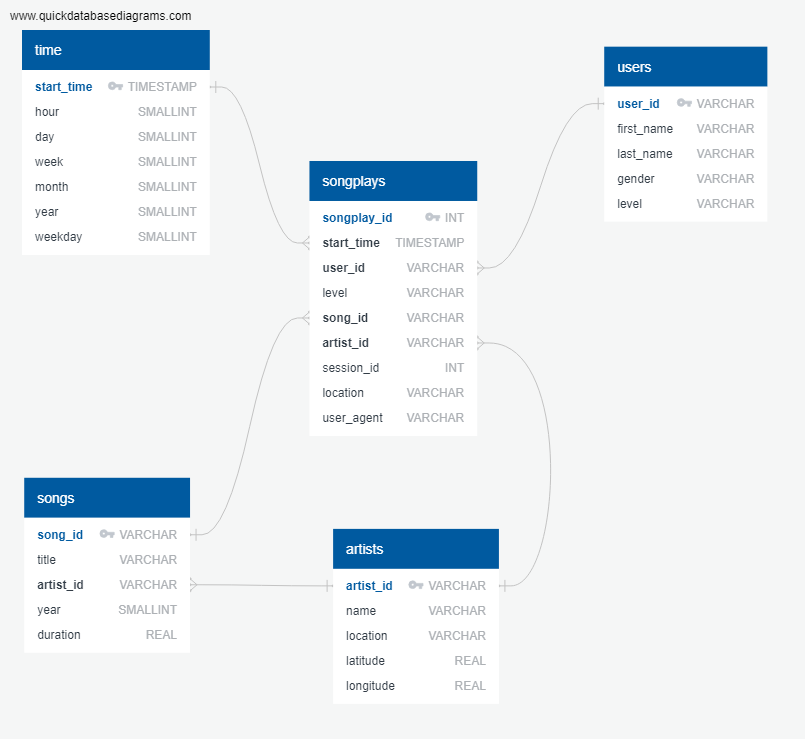

# DEP3
Project 3 of the Data Engineering Nanodegree  
Michal Pytlos, September 2019

## Overview
DEP3 is a set of scripts which create data warehouse on Amazon Redshift for a music streaming startup. The startup's data is stored on S3 in the form of JSON logs. The DEP3 scripts load this data into a set of dimensional tables which are to be used to find insights about what songs the startup's users are listening to.  

DEP3 scripts perform the following:
1. Create staging and analytics tables on Redshift
2. Load data from S3 to staging tables on Redshift
3. Load data from staging tables to analytics tables on Redshift

### Data
The startup's data is stored in a public bucket on S3 in two directories:
* **s3://udacity-dend/song_data** - files with songs metadata. Each file contains metadata on a single song in the JSON format with the following fields: num_songs, artist_id, artist_latitude, artist_longitude, artist_location, artist_name, song_id, title, duration and year.
* **s3://udacity-dend/log_data** - user activity log files. Each file contains data on user activity from a given day. Each line of this file contains data on a single activity of a user in JSON format with the following fields: artist, auth, firstName, gender, itemInSession, lastName, length, level, location, method, page, registration, sessionId, song, status, ts, userAgent and userId.

Notes on data:
* Song streaming events in the user activity log files have the *page* field set to *NextSong*.
* Songs from the user activity logs can be matched with their metadata files by comparing artist, song and length in the log file with artist_name, title and duration in the metadata file respectively.

### Database schema
The schema of the Redshift database is shown in the figure below. Tables *songplays* (fact table), *users*, *songs*, *artists* and *time* form a star schema optimized for queries on song play analysis. The chosen schema, compared to a highly normalized schema, allows for easier and faster data analytics by making the queries much simpler (fewer joins).

### ETL pipeline

1. Load data from S3 to staging tables on Redshift
  * data is loaded using the SQL COPY command with MAXERROR set to 1000
  * data is loaded from the log files to staging tables *as is* i.e. without any modifications or cleansing
  * information on errors during the copy is kept in the Redshift's *stl_load_errors* table
  * data is transferred directly from S3 to Redshift - the ETL server only issues the commands
2. Load data from staging tables to analytics tables on Redshift
  * data is loaded using the SQL bulk INSERT command (one transaction per table)
  * data is transferred directly from staging tables to analytics tables - the ETL server only issues the commands
  * only the relevant and unique data is loaded to the analytics tables

## Prerequisites
* Python 3.7 or higher with psycopg2 2.8 or higher
* Access to Amazon Redshift cluster (ideally in the same region as the S3 bucket i.e. *us-west-2*)

## Configuration
The provided configuration file **dwh.cfg** has several fields which need to be set before DEP3 scripts can be run; these fields are briefly described below:

| Section | Field  | Value*|
| -------| --------|-------|
| CLUSTER| HOST| endpoint provided in the Redshift management console without the port part|
| CLUSTER| DB_NAME| Redshift database name|
| CLUSTER| DB_USER| Redshift master user|
| CLUSTER| DB_PASSWORD| Redshift master user password|
| CLUSTER| DB_PORT| Redshift database port (default is 5439)|
| IAM ROLE| ARN| ARN of IAM role allowing Redshift to read from S3|

*&ast;All field values in dwh.cfg must be inside single quotes*

## Usage
To create staging and analytics tables on Redshift:
1. Navigate to the directory containing **create_tables.py**
2. Run `python create_tables.py`

To load data from S3 to analytics tables on Redshift (via staging tables):
1. Navigate to the directory containing **etl.py**
2. Run `python etl.py`
